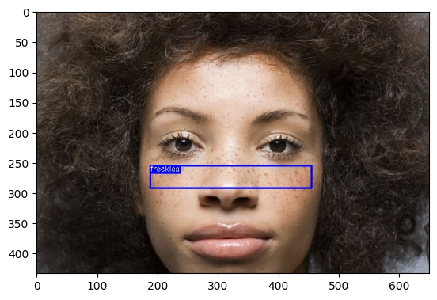
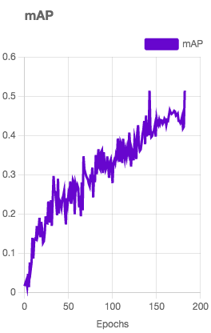

# Skin-problem-detection and Skincare Advices
SKIN PROBLEM DETECTION
## Introduction
Thís project aims to detect skin defects using machine learning and provide skincare advice using the OpenAI API and VinLlama
## General Process
1. **Data Collection** : Collect a diverse data of 1148 skin images with labeled defects.
2. **Data Augmentation** :
Flip: Horizontal
Rotation: Between -10° and +10°
Shear: ±15° Horizontal, ±15° Vertical
Saturation: Between -17% and +17%
Exposure: Between -3% and +3%
Mosaic: Applied
After augmentation, we have 3444 images.
3. **Model Training** :
I use Roboflows and YOLOV8 to train the model to classify skin defects

5. **Intergration with OpenAI** : Intergrate the trained model with the OpenAI API to provide skincare adviced based on detected skin conditions.
6. **User Interface**: I made a user friendly interface for users to upload images and receive skincare recommendation.
   Example: It looks like you may have some freckles, which are a common and natural occurrence in many people. To care for your skin and protect it from any potential damage, it's important to consistently use a broad-spectrum sunscreen with an SPF of 30 or higher, especially when spending time outdoors. Additionally, consider gentle exfoliation to maintain smooth and even skin texture. Always follow a skincare routine that is moisturizing and nourishing, and consider consulting a dermatologist for personalized advice.

## Dataset Description 
The dataset consists of 1148 images of various skin condition , icluding 6 types of acne, PIH, Melasma, freckles.
## Experimental Results
- **MAP** : The trained model achieves an mAP of 51% on the test set
  
- **User feedback** Some of my customers has tried and are sasitifed with the usefulness of this application 
